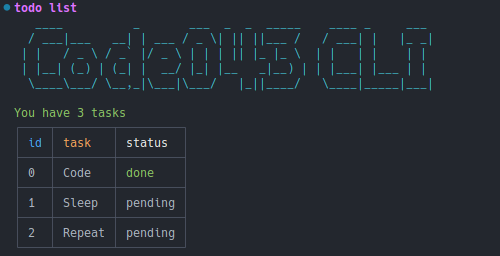

# Todo CLI

CLI made with CommanderJs

## initializing

### Requirements:

- Vscode
- Node
- Git

### Run the project:

    git clone https://github.com/code043/commander-cli.git

###

    cd commander-cli

###

    npm install

###

    npm link
###

    todo --help

## Preview

## Resources

- **Vscode:**
  - **Install:** https://code.visualstudio.com/download
  - **Repository:** https://github.com/microsoft/vscode
- **Node:**
  - **Install:** https://nodejs.org/en/download/package-manager/current
  - **Respository:** https://github.com/nodejs/node
- **Git:**
  - **Install:** https://git-scm.com/downloads
  - **Documantation**: https://git-scm.com/doc

